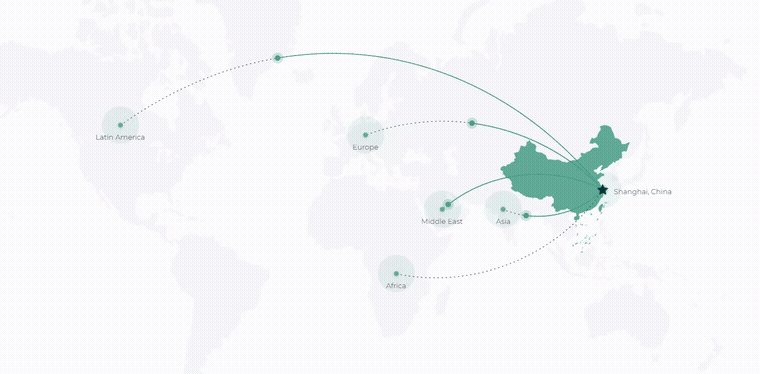

  

# TTT Hotspot on Map for Elementor

**English** | [中文](README.zh-CN.md) | [日本語](README.ja.md)

**An interactive hotspot map widget for Elementor** — place markers on a custom map image,
each opening its own info panel.

---

## Demo

*Click the animation for the full-quality recording → [`assets/demo.mp4`](assets/demo.mp4) (14s).*

---

## What this widget can do

A reference for how far an Elementor custom widget can be taken — it behaves like a small
application rather than a static image with pins.

### Authoring experience

- **Drag-to-place markers** — position hotspots by dragging them on the canvas in the editor,
  then save with one click. No typing coordinates.
- **Extend without limits** — the hotspot collection is fully user-managed: add, remove and
  reorder entries directly in the panel.
- **Contextual controls** — advanced options stay hidden until the feature they belong to is
  switched on, so the panel never overwhelms the person editing.
- **Independent responsive values** — desktop, tablet and mobile each keep their own settings
  for every dimension you can adjust.
- **Loads only where used** — the widget's styles and scripts are enqueued only on pages that
  actually contain it, leaving the rest of the site untouched.

### Visual and interaction

- **Curved links between hotspots** — connect markers to one another and control the curve's
  bend and direction from the panel. Real adjustable curves, not fixed arcs.
- **Orbiting marker animation** — markers can travel around the map with configurable
  direction, scheduling (all at once or one by one), speed behaviour, glow, and a styled
  motion trail.
- **Scale-proof positioning** — markers are anchored to the map image itself and re-project
  on every resize, container change or breakpoint switch, so layouts never drift.
- **Pulsing attention rings** — whose scale is controlled from the panel.
- **Hover states** built in for both markers and icons.

### Engineering quality

- **No dependencies** — plain JavaScript and CSS. Nothing pulled from a CDN, no jQuery required.
- **Editor-safe** — re-renders cleanly on every panel change, with no duplicated markers and
  no leaked event handlers.
- **Themeable from settings** — every colour, size and radius you see comes from the widget's
  own settings; the stylesheet holds no fixed visual values.

---

## Iteration record

**Twenty revisions — v1.0.0 through v1.0.20.**

This is the widget we iterated on most. Almost every revision came from using it against
real content: markers overlapping at certain viewport widths, info panels flipping off
screen near the edges, animations that looked fine in isolation but fought the page scroll.
The version history in the file header reads like a list of things you only find in production.

---

## What this repository is

**Production code, published to show how we build.**

- This is a **snippet**, not an installable plugin. No activation flow, no wp.org release.
- **No installation guide. No support. No portability guarantee.**
- Code assumes an Elementor-based WordPress stack and our own conventions.

---

## Assets

| File | Purpose |
|---|---|
| `assets/world-map.svg` | Default world map (1675×1082) used as the widget's base image |
| `assets/demo.gif` | Demo animation (embedded above) |
| `assets/demo.mp4` | Full-quality demo recording — 14s |
| `assets/logo.png` | Brand mark |

---

## Author

**Aloysius Luo** · [TTTWorks](https://tttworks.com)

Production WordPress engineering — performance, security, and custom Elementor widgets
for sites that have to hold up in the real world.

---

## License

Apache License 2.0 — permissive, **commercial use permitted**, trademark rights not granted. See [LICENSE](LICENSE).

---

**[TTTWorks](https://tttworks.com)** — Production WordPress engineering.
